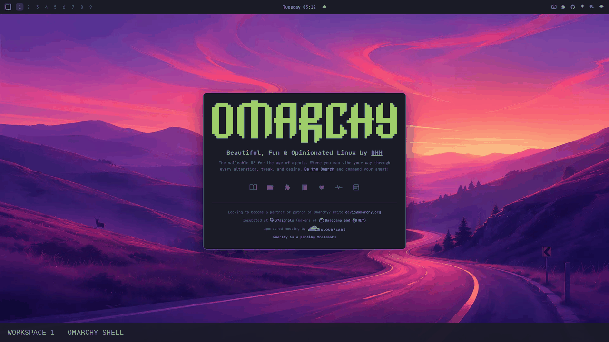

# Omarchy

A re-imagining of [omarchy.org](https://omarchy.org) — the Omarchy desktop, in the browser. The whole site is an interactive Omarchy-style workspace: a top bar, workspaces, a launcher menu, a tiling video wall, embedded app pages, and live widgets, all skinned with the real Omarchy themes.



**Live:** <https://mjtiempo.github.io/omarchy-site/>

---

## The desktop

| Workspace | Theme | What's on it |
| ----------- | ------- | -------------- |
| 1 | Tokyo Night | The Omarchy shell app — official brand mark, tagline, workspace dock, footer |
| 2 | Catppuccin | 2×2 tiled video wall (the YouTube videos from omarchy.org) |
| 3 | Everforest | The Manual — full-tile app |
| 4 | Lumon | News — full-tile app |
| 5 | Gruvbox | Teams — full-tile app |
| 6 | Kanagawa | Patrons — full-tile app |
| 7 | Miasma | Sponsorships — full-tile app |
| 8 | Nord | AIR — full-tile app |
| 9 | (Nord wall) | Meetups — full-tile app |

Click a workspace number to switch workspace *and* theme. Your workspace is remembered across visits.

### The bar

- **Left:** Omarchy logo (opens the launcher) + workspace numbers
- **Center:** live clock (click → calendar panel, right-click → cycle formats) + weather icon (click → forecast panel, middle-click → refresh)
- **Right:** system icons for the external links (ISO, Plugins, GitHub, Security, Discord, Merch)

### The launcher

Logo click opens an Omarchy-style menu with search, arrow-key navigation, and rows that do desktop-native things:

- **Manual / News / Teams / Patrons / Sponsorships / AIR / Meetups** → switch to that workspace's app tile
- **Security** → closable popup with the security page (also from the bar shield icon)
- **Brand** (footer) → closable popup with the brand page
- ISO / Plugins / GitHub / Discord / Merch → open in a new tab

## Running

No build step — just open it:

```bash
# directly
open index.html

# or serve it
python3 -m http.server
# → http://localhost:8000
```

There's also a published GitHub Pages build at <https://mjtiempo.github.io/omarchy-site/>.

## Structure

```text
index.html              — markup only (~56 KB)
assets/
├── css/site.css        — all styles + the 9 theme palettes
├── js/site.js          — clock, calendar, weather, launcher, themes, popups
└── images/
    ├── backgrounds/    — the 9 built-in Omarchy wallpapers
    ├── video/          — the 4 omarchy.org video thumbnails
    └── omarchy-pages.gif — showcase GIF
```

## How it's built

- **Vanilla HTML/CSS/JS** — no framework, no bundler, no dependencies
- **Themes:** each workspace uses a built-in Omarchy theme — its real `colors.toml` palette plus its default background, picked the same way `omarchy-theme-set` does
- **Data sources (client-side):** [wttr.in](https://wttr.in) + [Open-Meteo](https://open-meteo.com) for weather and geocoding, YouTube embeds for the video wall, and omarchy.org pages embedded as iframes (all verified frame-safe)
- Everything persists in `localStorage`: theme, clock format, week start, weather location

## Theming

Every surface is driven by CSS custom properties, so the whole desktop re-skins with each workspace: bar, launcher, panels, popups, apps. Palettes and tokens mirror the real Omarchy shell (`colors.toml`, `shell.toml` control tokens, Hyprland-style gaps/rounding).

## Notes & credits

- Omarchy is by [DHH](https://dhh.dk) — [omarchy.org](https://omarchy.org), [the manual](https://omarchy.org/manual/)
- The logo, mark, wordmark, and copy are used per the [Omarchy brand terms](https://omarchy.org/brand/) — "Omarchy is a pending trademark"
- This project is not affiliated with or endorsed by the Omacom Foundation, the Omarchy authors, or any of the linked services
